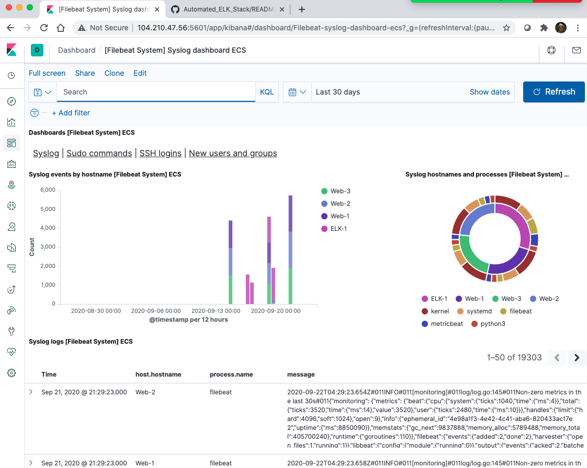

## Automated ELK Stack Deployment

The files in this repository were used to configure the network depicted below.

These files have been tested and used to generate a live ELK deployment on Azure. They can be used to either recreate the entire deployment pictured above. Alternatively, select portions of the _____ filebeat-playbook.yml file may be used to install only certain pieces of it, such as Filebeat.

[elk-config.yml](Ansible_Scripts/elk-config.yml)
[filebeat-config.yml](Ansible_Scripts/filebeat-config.yml)
[filebeat-playbook.yml](Ansible_Scripts/filebeat-playbook.yml)
[metricbeat-config.yml](Ansible_Scripts/metricbeat-config.yml)
[metricbeat-playbook.yml](Ansible_Scriptsmetricbeat-playbook.yml)

This document contains the following details:

- Description of the Topology
- Access Policies
- ELK Configuration
- Beats in Use
- Machines Being Monitored
- How to Use the Ansible Build

### Description of the Topology

The main purpose of this network is to expose a load-balanced and monitored instance of DVWA, the Damn Vulnerable Web Application.

Load balancing ensures that the application will be highly available, in addition to restricting access to the network.

Due to its function of distributing incoming network traffic, load balancers defend against denial of service (DDoS) attacks. In addition, using a web application firewall and authenticating user credentials will protect against unauthorized access.

Integrating an ELK server allows users to easily monitor the vulnerable VMs for changes to the system/applications files and system logs.

Filebeat monitors the log files or locations specified, collects log events and forwards to a log indexer.

Metricbeat collects metrics from the operating system and services running on the server.

The configuration details of each machine may be found below.

| Name     | Function   | IP Address | Operating System   |
|----------|------------|------------|--------------------|
| Jump Box | Gateway    | 10.0.0.1   | Linux Ubuntu 18.04 |            
| Web-1    | Web Server | 10.0.0.12  | Linux Ubuntu 18.04 |          
| Web-2    | Web Server | 10.0.0.11  | Linux Ubuntu 18.04 |     
| Web-3    | Web Server | 10.0.0.13  | Linux Ubuntu 18.04 |
| ELK-1    | Web Server | 10.1.0.4   | Linux Ubuntu 18.04 |

### Access Policies

The machines on the internal network are not exposed to the public Internet.

Only the Jump-Box machine can accept connections from the Internet. Access to this machine is only allowed from the following IP addresses:

73.185.40.98

Machines within the network can only be accessed by the Jump-Box VM.

52.191.143.223/10.0.0.4

A summary of the access policies in place can be found in the table below.

| Name     | Publicly Accessible | Allowed IP Addresses                            |
|----------|---------------------|-------------------------------------------------|
| Jump-Box | Yes                 | 73.185.40.98                                    |
| Web-1    | No                  | 52.191.143.223                                  |
| Web-2    | No                  | 52.191.143.223                                  |
| Web-3    | No                  | 52.191.143.223                                  |
| RedLB    | Yes                 | Any Public IP                                   |
| ELK-1    | No                  | 10.0.0.11, 10.0.0.12, 10.0.0.13, 52.191.143.223 |

### Elk Configuration

Ansible was used to automate configuration of the ELK machine. No configuration was performed manually, which is advantageous because:
- Simplifies repetitive and tedious operations
- Standardization, less variance from system builds
- Increases security configuration

The playbook implements the following tasks:

- Install python-pip3
- Install Docker
- Increases virtual memory
- Use memory
- download ELK image
- Run yaml configuration file to install ELK
- Start ELK server

The following screenshot displays the result of running `docker ps` after successfully configuring the ELK instance.

### Target Machines & Beats
This ELK server is configured to monitor the following machines:

Web-1   10.0.0.12
Web-2   10.0.0.11
Web-3   10.0.0.13

We have installed the following Beats on these machines:

Filebeat

Filebeat is a lightweight shipper for forwarding and centralizing log data. Filebeat monitors the log files or locations that you specify, collects log events, and forwards them either to Elasticsearch or Logstash for indexing.

The following screenshot displays the Filebeat dashboard.

Metricbeat

Metricbeat is a lightweight shipper that collects system and services metrics. Metricbeat takes the metrics and statistics that it collects and ships them to the output that you specify, such as Elasticsearch or Logstash.

The following screenshot displays the Metricbeat dashboard.

### Using the Playbook
In order to use the playbook, you will need to have an Ansible control node already configured. Assuming you have such a control node provisioned:

SSH into the control node and follow the steps below:

- Copy the elk-config.yml file to /etc/ansible/files folder.
- Update the hosts file to include IP addresses and ports of the machines you want to run the playbooks on.
- Run the playbook, and navigate to Kibana to check that the installation worked as expected.

Verify ELK by going to http://104.210.47.56:5601/app/kibana

Commands for downloading the playbooks

elk-config.yml `curl https://github.com/g-vera/Automated_ELK_Stack/blob/master/Ansible_Scripts/elk-config.yml > /etc/ansible/files/elk-config.yml’

filebeat-config.yml `curl https://github.com/g-vera/Automated_ELK_Stack/blob/master/Ansible_Scripts/filebeat-config.yml > /etc/ansible/files/filebeat-config.yml’

filebeat-playbook.yml `curl https://github.com/g-vera/Automated_ELK_Stack/blob/master/Ansible_Scripts/filebeat-playbook.yml > /etc/ansible/files/filebeat-playbook.yml’

metricbeat-config.yml `curl https://github.com/g-vera/Automated_ELK_Stack/blob/master/Ansible_Scripts/metricbeat-config.yml > /etc/ansible/files/metricbeat-config.yml’

metricbeat-playbook.yml `curl https://github.com/g-vera/Automated_ELK_Stack/blob/master/Ansible_Scripts/metricbeat-playbook.yml > /etc/ansible/files/metricbeat-playbook.yml’
