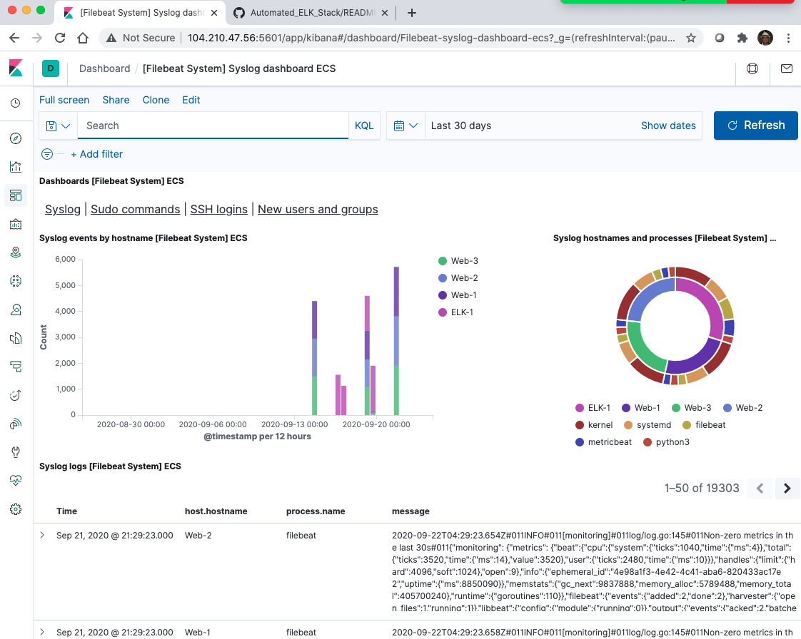
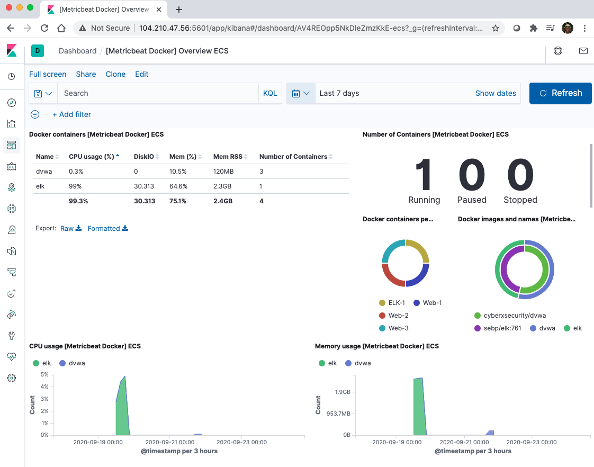

## Automated ELK Stack Deployment

The files in this repository were used to configure the network depicted below.

These files have been tested and used to generate a live ELK deployment on Azure. They can be used to either recreate the entire deployment pictured above. Alternatively, select portions of the _____ filebeat-playbook.yml file may be used to install only certain pieces of it, such as Filebeat.

  - _TODO: Enter the playbook file._
  ---
  - name: installing and launching filebeat
    hosts: webservers
    become: yes
    tasks:

    - name: download filebeat deb
      command: curl -L -O https://artifacts.elastic.co/downloads/beats/filebeat/filebeat-7.4.0-amd64.deb

    - name: install filebeat deb
      command: dpkg -i filebeat-7.4.0-amd64.deb

    - name: drop in filebeat.yml
      copy:
        src: /etc/ansible/files/filebeat-config.yml
        dest: /etc/filebeat/filebeat.yml

    - name: enable and configure system module
      command: sudo filebeat modules enable system

    - name: setup filebeat
      command: sudo filebeat setup

    - name: start filebeat service
      command: sudo service filebeat start

This document contains the following details:
- Description of the Topology
- Access Policies
- ELK Configuration
  - Beats in Use
  - Machines Being Monitored
- How to Use the Ansible Build

### Description of the Topology

The main purpose of this network is to expose a load-balanced and monitored instance of DVWA, the D*mn Vulnerable Web Application.

Load balancing ensures that the application will be highly _____ available, in addition to restricting _____ access to the network.
- _TODO: What aspect of security do load balancers protect? What is the advantage of a jump box?_
Due to their function of distributing incoming network traffic, load balancers defend against denial of service (DDoS) attacks. In addition, using a web application firewall and authenticating user credentials will protect against unauthorized access.

Integrating an ELK server allows users to easily monitor the vulnerable VMs for changes to the _____ applications/files and system _____ environment.
- _TODO: What does Filebeat watch for?_ Filebeat monitors the log files or locations specified, collects log events and forwards to a log indexer.
- _TODO: What does Metricbeat record?_ Metricbeat collects metrics from the operating system and services running on the server.

The configuration details of each machine may be found below.
_Note: Use the [Markdown Table Generator](http://www.tablesgenerator.com/markdown_tables) to add/remove values from the table_.

| Name     | Function   | IP Address | Operating System   |
|----------|------------|------------|--------------------|
| Jump Box | Gateway    | 10.0.0.1   | Linux Ubuntu 18.04 |            
| Web-1    | Web Server | 10.0.0.12  | Linux Ubuntu 18.04 |          
| Web-2    | Web Server | 10.0.0.11  | Linux Ubuntu 18.04 |     
| Web-3    | Web Server | 10.0.0.13  | Linux Ubuntu 18.04 |
| ELK-1    | Web Server | 10.1.0.4   | Linux Ubuntu 18.04 |

### Access Policies

The machines on the internal network are not exposed to the public Internet.

Only the _____ Jump-Box VM machine can accept connections from the Internet. Access to this machine is only allowed from the following IP addresses:
- _TODO: Add whitelisted IP addresses_

73.185.40.98

Machines within the network can only be accessed by _____ the Jump-Box VM.
- _TODO: Which machine did you allow to access your ELK VM? What was its IP address?_
52.191.143.223

A summary of the access policies in place can be found in the table below.

| Name     | Publicly Accessible | Allowed IP Addresses                            |
|----------|---------------------|-------------------------------------------------|
| Jump-Box | Yes                 | 73.185.40.98                                    |
| Web-1    | No                  | 52.191.143.223                                  |
| Web-2    | No                  | 52.191.143.223                                  |
| Web-3    | No                  | 52.191.143.223                                  |
| RedLB    | Yes                 | Any Public IP                                   |
| ELK-1    | No                  | 10.0.0.11, 10.0.0.12, 10.0.0.13, 52.191.143.223 |

### Elk Configuration

Ansible was used to automate configuration of the ELK machine. No configuration was performed manually, which is advantageous because...
- _TODO: What is the main advantage of automating configuration with Ansible?_

Simplifies repetitive and tedious operations
Standardization, less variance from system builds
Increases security configuration

The playbook implements the following tasks:
- _TODO: In 3-5 bullets, explain the steps of the ELK installation play. E.g., install Docker; download image; etc._
- Install python-pip3
- Install docker
- Increases virtual memory
- download ELK image
- Run yaml configuration file to install ELK
- Start ELK server

The following screenshot displays the result of running `docker ps` after successfully configuring the ELK instance.

### Target Machines & Beats
This ELK server is configured to monitor the following machines:
- _TODO: List the IP addresses of the machines you are monitoring_
Web-1   10.0.0.12
Web-2   10.0.0.11
Web-3   10.0.0.13

We have installed the following Beats on these machines:
- _TODO: Specify which Beats you successfully installed_
Filebeat
Metricbeat

These Beats allow us to collect the following information from each machine:
- _TODO: In 1-2 sentences, explain what kind of data each beat collects, and provide 1 example of what you expect to see. E.g., `Winlogbeat` collects Windows logs, which we use to track user logon events, etc._
Filebeat is a lightweight shipper for forwarding and centralizing log data. Filebeat monitors the log files or locations that you specify, collects log events, and forwards them either to Elasticsearch or Logstash for indexing.

The following screenshot displays the Filebeat dashboard.

Metricbeat is a lightweight shipper that collects system and services metrics. Metricbeat takes the metrics and statistics that it collects and ships them to the output that you specify, such as Elasticsearch or Logstash.

The following screenshot displays the Metricbeat dashboard.

### Using the Playbook
In order to use the playbook, you will need to have an Ansible control node already configured. Assuming you have such a control node provisioned:

SSH into the control node and follow the steps below:
- Copy the _____ elk-config.yml file to _____ ansible folder.
- Update the _____ elk-config.yml file to include...IPs and ports.
- Run the playbook, and navigate to ____ ELK server to check that the installation worked as expected.

_TODO: Answer the following questions to fill in the blanks:_
- _Which file is the playbook? Where do you copy it?_
- _Which file do you update to make Ansible run the playbook on a specific machine? hosts.cfg  How do I specify which machine to install the ELK server on versus which to install Filebeat on?_ add group that ELK belongs
- _Which URL do you navigate to in order to check that the ELK server is running?

sudo docker start elk
sudo docker ps

http://....:5601/app/kibana

_As a **Bonus**, provide the specific commands the user will need to run to download the playbook, update the files, etc._
curl http link
